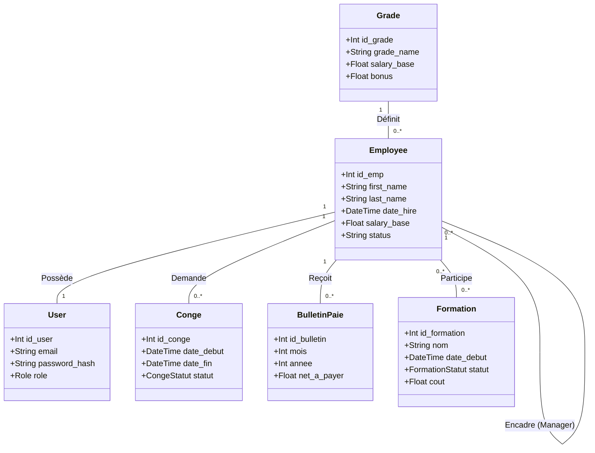

# RAPPORT DE SOUTENANCE
## Projet de Fin d'Études (PI 2026)

---

# PAGE DE GARDE

**Titre du projet :** SmartRH – Plateforme Web de Gestion des Ressources Humaines pour PME

**Type :** Projet Informatique – Application Web

**Auteurs :**

- Mouhameden Mohamed Zein Mohamed El Mamy (24063)
- Med Mahmoude (24149)

**Encadrant :** Chaikanie Seyed

**Établissement :** ENSUP (Information Technology)  
**Année académique :** 2025 – 2026

---

# Remerciements

Nous exprimons nos sincères remerciements à notre encadrant **M. Chaikanie Seyed** pour son accompagnement, ses conseils techniques et son soutien durant toute la réalisation de ce projet.

Nous remercions également l’ensemble du corps pédagogique de l'ENSUP pour la qualité de la formation dispensée durant notre parcours académique.

Enfin, nous remercions nos familles et nos collègues pour leur soutien moral et leur encouragement.

---

# Résumé

Dans un contexte de transformation numérique des entreprises, la gestion des ressources humaines nécessite des solutions modernes permettant d'améliorer l'efficacité organisationnelle.

Le projet **SmartRH** est une application web destinée aux petites et moyennes entreprises (PME). Elle permet de centraliser et automatiser les principales opérations RH telles que :

- la gestion des employés
- la gestion des congés
- la gestion des salaires (édition des bulletins de paie)
- la gestion des formations
- la visualisation des indicateurs RH via un tableau de bord

La solution repose sur une architecture **Full-Stack moderne basée sur Next.js, Prisma et PostgreSQL**, garantissant performance, sécurité et évolutivité.

---

# Abstract

In the context of digital transformation, companies require modern tools to manage human resources efficiently.

**SmartRH** is a web application designed for small and medium-sized enterprises (SMEs). It centralizes HR processes such as employee management, payroll management, leave requests, and training tracking.

The system is built using a modern **Full-Stack architecture based on Next.js, Prisma ORM, and PostgreSQL**, ensuring scalability, performance, and security.

---

# Table des matières

1. [Introduction](#1-introduction)
2. [Présentation Générale du Projet](#2-présentation-générale-du-projet)
3. [Étude et Analyse du Besoin](#3-étude-et-analyse-du-besoin)
4. [Méthodologie de Développement](#4-méthodologie-de-développement)
5. [Conception du Système](#5-conception-du-système)
6. [Réalisation Technique](#6-réalisation-technique)
7. [Tests et Validation](#7-tests-et-validation)
8. [Déploiement et Mise en Production](#8-déploiement-et-mise-en-production)
9. [Perspectives d'Évolution](#9-perspectives-dévolution)
10. [Conclusion](#10-conclusion)
11. [Bibliographie](#11-bibliographie)

---

# 1. Introduction

La transformation numérique des organisations a profondément modifié les méthodes de gestion des ressources humaines. Les entreprises doivent aujourd'hui gérer un volume important de données liées aux employés, aux salaires, aux formations et aux congés.

Cependant, de nombreuses PME utilisent encore des méthodes traditionnelles telles que les fichiers Excel ou les dossiers papier, ce qui entraîne :

- une dispersion de l'information
- un manque de traçabilité
- des risques d'erreurs administratives

Dans ce contexte, le projet **SmartRH** vise à développer une solution informatique permettant de centraliser et automatiser les processus RH au sein d'une organisation.

---

# 2. Présentation Générale du Projet

## 2.1 Objectifs du projet

Les principaux objectifs du projet SmartRH sont :

- **Centraliser** les informations des employés au sein d'une base de données unique.
- **Automatiser** les flux de travail RH (demandes de congés, calcul des salaires).
- **Améliorer** la prise de décision grâce à des indicateurs RH (KPIs) visuels.
- **Simplifier** la communication et la transparence entre employés, managers et service RH.

## 2.2 Public cible

La plateforme est destinée principalement aux :

- PME (Petites et Moyennes Entreprises)
- Startups en phase de croissance
- Organisations de taille moyenne souhaitant digitaliser leurs processus.

---

# 3. Étude et Analyse du Besoin

## 3.1 Contexte

Les petites entreprises rencontrent souvent plusieurs difficultés dans la gestion des ressources humaines dues à l'absence d’outils spécialisés et au manque d’automatisation. La gestion manuelle devient chronophage et sujette aux erreurs à mesure que l'effectif grandit.

## 3.2 Problématique

**Comment concevoir une plateforme numérique intégrée capable de simplifier et automatiser efficacement la gestion des ressources humaines dans une PME ?**

## 3.3 Solution proposée

La solution consiste à développer une plateforme web intégrée offrant des fonctionnalités personnalisées par rôles (Admin, Manager, Employé) pour gérer :

- Le cycle de vie des employés
- La configuration hiérarchique (Grades) et salariale
- Le cycle des congés et absences
- Le plan de développement des compétences (Formations)

---

# 4. Méthodologie de Développement

Pour le développement de SmartRH, nous avons adopté une **méthodologie Agile (Scrum)** permettant :

- Un développement progressif par itérations (sprints).
- Une adaptation rapide aux retours utilisateurs.
- Une amélioration continue de la qualité du code.

Les principales étapes du projet ont suivi le cycle classique du génie logiciel :
1. Analyse fonctionnelle et technique
2. Conception architecturale (UML & Schéma BD)
3. Développement Full-Stack (Frontend & Backend simultané)
4. Tests unitaires et d'intégration
5. Déploiement et Documentation

---

## 5. Conception du Système

### 5.1 Architecture logicielle

L’application suit une architecture **Full Stack moderne** tirant parti des dernières avancées du JavaScript.

**Architecture générale :**
Utilisateur (Browser) ↔ Interface Web (React / Next.js) ↔ API Backend (Next.js Server Actions/Routes) ↔ ORM Prisma ↔ Base de données PostgreSQL/MySQL

### 5.2 Modélisation Fonctionnelle (Diagramme de Cas d'Utilisation)

Le diagramme suivant illustre les interactions possibles entre les différents types d'utilisateurs et les fonctionnalités de SmartRH.

```mermaid
useCaseDiagram
    actor "Employé" as E
    actor "Manager" as M
    actor "Gestionnaire RH" as RH

    package "SmartRH System" {
        usecase "S'authentifier" as UC1
        usecase "Consulter son Profil" as UC2
        usecase "Demander un Congé" as UC3
        usecase "Consulter le Catalogue Formation" as UC4
        usecase "Valider les Congés (Équipe)" as UC5
        usecase "Gérer les Employés" as UC6
        usecase "Calculer la Paie" as UC7
        usecase "Gérer les Formations" as UC8
    }

    E --> UC1
    E --> UC2
    E --> UC3
    E --> UC4

    M --|> E
    M --> UC5

    RH --|> M
    RH --> UC6
    RH --> UC7
    RH --> UC8

    UC3 ..> UC1 : <<include>>
    UC5 ..> UC1 : <<include>>
    UC6 ..> UC1 : <<include>>
```

### 5.3 Modélisation des Données (Diagramme de Classes)

Le diagramme de classes suivant représente la structure relationnelle de la base de données SmartRH.



---

# 6. Réalisation Technique

### 6.2. Identité Visuelle et Design System

Pour SmartRH, nous avons développé une identité visuelle "Premium" qui s'éloigne des interfaces RH classiques (souvent austères). 

**Choix Graphiques :**
*   **Palette de Couleurs :** Utilisation d'un dégradé de **Teal** (Bleu-Vert) profond (`#0d9488`) associé à des tons de **Slate** (Ardoise) pour un rendu moderne et apaisant.
*   **Mode Sombre et Verre (Glassmorphism) :** L'interface utilise des effets de flou d'arrière-plan (`backdrop-filter`) et des transparences pour donner de la profondeur.
*   **Typographie :** Emploi de polices système monospécifiées (Space Mono) pour un aspect technique et précis, renforçant l'image de "solution intelligente".

**Infrastructure CSS :**
*   **Tailwind CSS 4 :** Framework utilitaire permettant une personnalisation totale sans fichiers CSS lourds.
*   **Système de Design (Shadcn UI) :** Base de composants atomiques (Boutons, Cards, Modals) harmonisés, garantissant une cohérence visuelle parfaite sur toutes les pages.
*   **Responsive Design :** Utilisation de grilles flexibles (Flexbox et CSS Grid) pour assurer une accessibilité sur ordinateurs, tablettes et smartphones.

## 6.3. Fonctionnalités principales

### Gestion des employés
Outil complet permettant d'ajouter, modifier, consulter (fiches détaillées) et archiver les informations des collaborateurs.

### Gestion des congés
Interface intuitive permettant l'envoi de demandes avec notification automatique au manager, qui peut alors approuver ou refuser selon le calendrier de l'équipe.

### Tableau de bord RH (Dashboard)
Visualisation dynamique via des graphiques (Recharts) des indicateurs clés : effectifs par département, état de la paie mensuelle, et alertes de congés.

---

# 7. Tests et Validation

Plusieurs phases de tests ont été réalisées afin de garantir la robustesse de SmartRH :

- **Tests fonctionnels :** Vérification de chaque action utilisateur (ex: soumission de formulaire).
- **Tests d'interface (UI) :** Garantie de la réactivité sur mobile et tablette.
- **Tests de données :** Validation de l'intégrité référentielle en base de données via Prisma.

Les résultats confirment que la plateforme répond aux exigences du cahier des charges initial.

---

# 8. Déploiement et Mise en Production

Le projet SmartRH est optimisé pour le cloud :

- **Hébergement Frontend/API :** Vercel (pour sa performance native avec Next.js).
- **Base de Données :** Railway ou Render (Serverless PostgreSQL).
- **CI/CD :** Pipeline automatisé via GitHub Actions pour chaque déploiement.

---

# 9. Perspectives d’Évolution

Le projet est conçu pour être évolutif :

- **Extension Mobile :** Portabilité vers une application mobile Native.
- **Module Recrutement :** Suivi des candidats et gestion des entretiens.
- **Analyse IA :** Module de prédiction du turn-over et recommandations de formations.
- **Signatures Électroniques :** Pour les contrats et bulletins de paie.

---

# 10. Conclusion

Le projet **SmartRH** constitue une solution concrète et moderne pour la digitalisation des RH dans les PME.

Ce travail de fin d'études nous a permis de consolider nos connaissances en développement Full-Stack et en gestion de projet technique. Nous avons réussi à concevoir un outil qui allie esthétique premium et robustesse technique, prêt pour une utilisation réelle en entreprise.

---

# 11. Bibliographie

1. **Next.js Documentation** - https://nextjs.org/docs
2. **Prisma ORM Documentation** - https://www.prisma.io/docs
3. **React.js Official Docs** - https://react.dev
4. **PostgreSQL Manual** - https://www.postgresql.org/docs
5. **Tailwind CSS Documentation** - https://tailwindcss.com/docs
