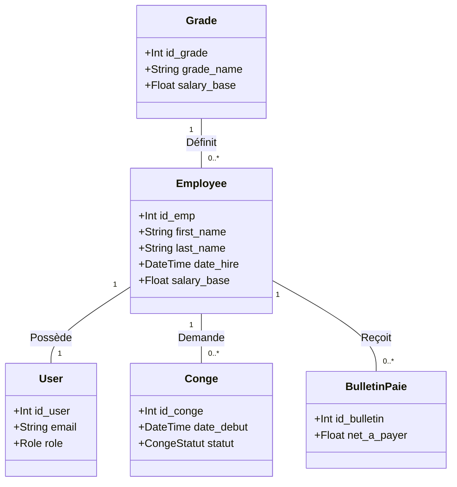

# RAPPORT DE SOUTENANCE
## Projet de Fin d’Études (PI 2026)

---

# PAGE DE GARDE

**Titre du projet :**  
**SmartRH – Plateforme Web Intelligente de Gestion des Ressources Humaines pour PME**

**Type de projet :**  
Projet Informatique – Application Web Full Stack

**Réalisé par :**  
*   **Mouhameden Mohamed Zein Mohamed El Mamy** — Matricule : **24063**
*   **Med Mahmoude** — Matricule : **24149**

**Encadrant pédagogique :**  
**M. Chaikanie Seyed**

**Établissement :**  
ENSUP – Information Technology

**Année académique :**  
2025 – 2026

---

# Remerciements

Nous tenons à exprimer notre profonde gratitude à **notre encadrant M. Chaikanie Seyed** pour son accompagnement précieux, ses conseils techniques et son soutien constant durant toute la réalisation de ce projet.

Nous remercions également **l’ensemble du corps pédagogique de l’ENSUP** pour la qualité de la formation dispensée durant notre parcours académique.

Enfin, nous adressons nos sincères remerciements à **nos familles et nos collègues** pour leur soutien moral et leurs encouragements tout au long de ce travail.

---

# Résumé

Dans un contexte de transformation numérique accélérée, les entreprises doivent moderniser leurs méthodes de gestion des ressources humaines afin d'améliorer leur efficacité organisationnelle.

Le projet **SmartRH** est une **application web intelligente destinée aux petites et moyennes entreprises (PME)**. Elle permet de **centraliser et automatiser les processus RH** tels que :
*   la gestion des employés
*   la gestion des congés
*   la gestion des salaires
*   la gestion des formations
*   l’analyse des indicateurs RH via un tableau de bord interactif

La solution repose sur une **architecture Full Stack moderne** basée sur **Next.js, Prisma ORM et PostgreSQL**, offrant performance, sécurité et évolutivité.

SmartRH vise ainsi à **faciliter la prise de décision et améliorer la gestion du capital humain dans les entreprises.**

---

# Abstract

In the context of rapid digital transformation, companies need modern tools to manage human resources more efficiently.

**SmartRH** is a web-based platform designed for **Small and Medium Enterprises (SMEs)** to centralize and automate HR processes such as:
*   employee management
*   payroll management
*   leave requests
*   training management
*   HR analytics dashboard

The application is built using a **modern full-stack architecture** based on **Next.js, Prisma ORM, and PostgreSQL**, ensuring scalability, performance, and security.

SmartRH contributes to improving organizational efficiency and decision-making through digital HR management.

---

# Table des matières

1. [Introduction](#1-introduction)
2. [Présentation Générale du Projet](#2-présentation-générale-du-projet)
3. [Étude et Analyse du Besoin](#3-étude-et-analyse-du-besoin)
4. [Méthodologie de Développement](#4-méthodologie-de-développement)
5. [Conception du Système](#5-conception-du-système)
6. [Réalisation Technique](#6-réalisation-technique)
7. [Tests et Validation](#7-tests-et-validation)
8. [Déploiement et Mise en Production](#8-déploiement-et-mise-en-production)
9. [Perspectives d’Évolution](#9-perspectives-dévolution)
10. [Conclusion](#10-conclusion)
11. [Bibliographie](#11-bibliographie)

---

# 1. Introduction

La transformation numérique a profondément modifié les méthodes de gestion des entreprises. Les départements des ressources humaines doivent aujourd’hui gérer un volume important d’informations concernant les employés, les congés, les salaires et les formations.

Cependant, de nombreuses **PME utilisent encore des outils traditionnels** tels que les feuilles Excel ou les dossiers papier, ce qui entraîne :
*   une dispersion de l'information
*   un manque de traçabilité
*   un risque élevé d'erreurs administratives
*   une perte de temps dans la gestion quotidienne

Dans ce contexte, le projet **SmartRH** a pour objectif de concevoir une **plateforme numérique centralisée permettant d'automatiser et simplifier la gestion des ressources humaines.**

---

# 2. Présentation Générale du Projet

## 2.1 Objectifs du projet
Les objectifs principaux du projet **SmartRH** sont :
*   **Centraliser** les données des employés dans une base de données unique.
*   **Automatiser** les processus RH tels que les demandes de congés et la gestion des salaires.
*   Offrir une **visualisation claire** des indicateurs RH grâce à un tableau de bord.
*   Faciliter la communication entre les employés, les managers et le service RH.

## 2.2 Public cible
La plateforme SmartRH est destinée principalement aux :
*   **Petites et Moyennes Entreprises (PME)**
*   **Startups en croissance**
*   **Organisations souhaitant digitaliser leur gestion RH**

---

# 3. Étude et Analyse du Besoin

## 3.1 Contexte
Les entreprises modernes doivent gérer un nombre croissant d’employés et de processus administratifs. Sans outils numériques adaptés, cette gestion devient rapidement complexe. Les PME en particulier disposent souvent de **ressources limitées**, ce qui rend l’utilisation de systèmes RH coûteux difficile.

## 3.2 Problématique
La problématique principale peut être formulée comme suit :  
**Comment concevoir une plateforme numérique efficace permettant d’automatiser la gestion des ressources humaines dans une PME tout en restant simple, accessible et évolutive ?**

## 3.3 Solution proposée
La solution consiste à développer **SmartRH**, une plateforme web intégrée permettant de gérer :
*   les employés
*   les grades et niveaux hiérarchiques
*   les congés
*   les salaires
*   les formations
*   les indicateurs RH

Le système est basé sur **trois rôles utilisateurs :** Administrateur RH, Manager et Employé.

---

# 4. Méthodologie de Développement

Le développement du projet SmartRH suit la **méthodologie Agile (Scrum)**. Cette approche permet :
*   un développement itératif
*   une adaptation rapide aux changements
*   une amélioration continue du produit

Les principales étapes du projet sont l'analyse des besoins, la conception, le développement Full Stack, les tests et le déploiement final.

---

# 5. Conception du Système

## 5.1 Architecture logicielle
SmartRH repose sur une architecture **Full Stack moderne** :
```
Utilisateur (Navigateur Web) ↔ Interface Frontend (Next.js / React) ↔ API Backend (Next.js Server Actions) ↔ ORM Prisma ↔ Base de données PostgreSQL
```

## 5.2 Diagramme de Cas d’Utilisation
Le diagramme suivant illustre les interactions possibles entre les acteurs et le système SmartRH :

```mermaid
useCaseDiagram
    actor "Employé" as E
    actor "Manager" as M
    actor "Gestionnaire RH" as RH

    package "SmartRH System" {
        usecase "S'authentifier" as UC1
        usecase "Consulter son Profil" as UC2
        usecase "Demander un Congé" as UC3
        usecase "Consulter le Catalogue Formation" as UC4
        usecase "Valider les Congés (Équipe)" as UC5
        usecase "Gérer les Employés" as UC6
        usecase "Calculer la Paie" as UC7
        usecase "Gérer les Formations" as UC8
    }

    E --> UC1
    E --> UC2
    E --> UC3
    E --> UC4

    M --|> E
    M --> UC5

    RH --|> M
    RH --> UC6
    RH --> UC7
    RH --> UC8
```

## 5.3 Diagramme de Classes (Schéma de Données)
La structure relationnelle est modélisée par les entités clés suivantes :



---

# 6. Réalisation Technique

## 6.1 Technologies utilisées
*   **Frontend :** Next.js, React, Tailwind CSS, Shadcn UI
*   **Backend :** Node.js, Prisma ORM
*   **Base de données :** PostgreSQL / MySQL

## 6.2 Identité Visuelle et Design System
L’interface SmartRH utilise une identité visuelle "Premium" basée sur :
*   Palette **Teal (#0d9488)** associée au Slate profond.
*   Design **Glassmorphism** avec effets de flou (`backdrop-filter`).
*   **Mode sombre** optimisé pour le confort utilisateur.
*   Design **responsive** total (Mobile, Tablette, Desktop).

## 6.3 Fonctionnalités principales
*   **Gestion des employés :** CRUD complet et fiches détaillées.
*   **Gestion des congés :** Circuit de validation automatisé entre employé et manager.
*   **Tableau de bord :** Graphiques dynamiques (Recharts) pour les statistiques RH.

---

# 7. Tests et Validation
*   **Tests fonctionnels :** Vérification de la logique métier (ex: calcul paie).
*   **Tests d’interface :** Validation de l'ergonomie et du responsive.
*   **Tests de base de données :** Intégrité référentielle garantie par Prisma.

---

# 8. Déploiement et Mise en Production
Le projet SmartRH est déployé sur le cloud :
*   **Frontend :** Vercel
*   **Base de données :** PostgreSQL sur Railway / Render
*   **CI/CD :** Pipeline automatisé via GitHub Actions.

---

# 9. Perspectives d’Évolution
*   Application mobile native.
*   Module de recrutement intelligent.
*   Analyse prédictive RH avec Intelligence Artificielle.
*   Signature électronique des contrats.

---

# 10. Conclusion
Le projet **SmartRH** constitue une solution concrète pour la digitalisation des RH. Ce travail nous a permis de consolider nos connaissances en développement Full Stack et en architecture logicielle moderne, tout en répondant à un besoin métier réel.

---

# 11. Bibliographie
1. **Next.js Documentation** - https://nextjs.org/docs
2. **Prisma ORM Documentation** - https://www.prisma.io/docs
3. **React Official Documentation** - https://react.dev
4. **PostgreSQL Documentation** - https://www.postgresql.org/docs
5. **Tailwind CSS Documentation** - https://tailwindcss.com/docs
